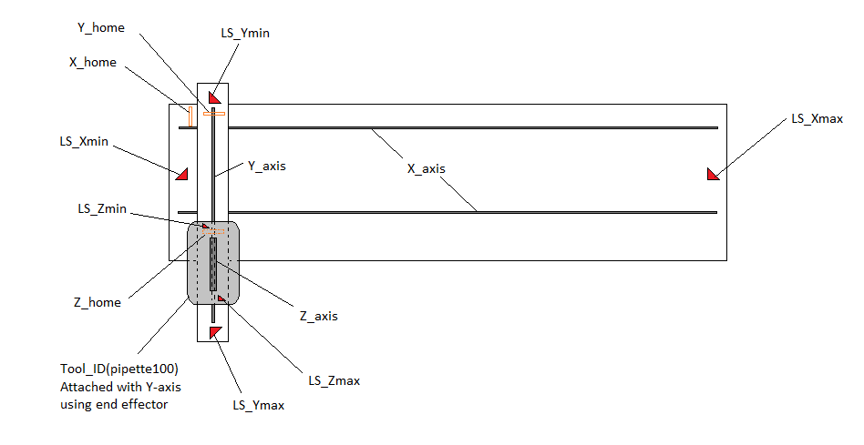

# G-Code for Orchestrator Individual Operation



## Some of G-code used in current Orchestrator Prototype unit :

```G-code
G28  # go to home position
M84  # motor stop
G01  # linier interpolation
G00  # rapid interpolation
G02  # Controlled arc movements clockwise using X and Y axis
G03  # Controlled arc movements counter clockwise using X and Y axis
F500 # Feed rate mm per munite, here 500mm per munite
```

> **Kindly visit that link -** https://reprap.org/wiki/G-code  **for more information on RepRap 3d printer G-codes and M-codes, as well as compatible with smoothie board.**

> **Here is an example of two axis (X,Y) system works using smoothie board** 

```G-code
G28                    # Go to home all axis
G01 X100 F500          # X axis move to position 100 at speed 500mm per munite
G01 Y200 F1000         # Y axis move to position 200 at speed 1000mm per munite
G01 Y100               # Y axis move to position 100 at speed previous line specified per munite
G01 X50                # X axis move to position 100 at speed last specified line per munite
G01 X120 Y200 F2500    # Y axis and X axis both move to position 120 for x and 200 for y at speed 2500mm per munite
G01 X150 Y210 F500     # Y axis and X axis both move to position 150 for x and 210 for y at speed 500mm per munite (secondary home position)
G01 X120 Y200 F2000    # Y axis and X axis both move to position 120 for x and 200 for y at speed 2000mm per munite
G01 X150 Y210 F500     # Y axis and X axis both move to position 150 for x and 210 for y at speed 500mm per munite (secondary home position)
G01 X120 Y200 F2500    # Y axis and X axis both move to position 120 for x and 200 for y at speed 2500mm per munite
G01 X150 Y210 F500     # Y axis and X axis both move to position 150 for x and 210 for y at speed 500mm per munite (secondary home position)
G01 X120 Y200 F1500    # Y axis and X axis both move to position 120 for x and 200 for y at speed 1500mm per munite
G01 X150 Y210 F500     # Y axis and X axis both move to position 150 for x and 210 for y at speed 500mm per munite (secondary home position)
M84                    # Motors are off

```

**Video link of working of that code in prototype version -** https://www.loom.com/share/669f7dd800bd4d65b211347162ab728d


## Code List :

| Code Name                              | Code ID |
| :------------------------------------- | ------- |
| ***'GET_10UL_ELECTRONIC_PIPETTE'***    | GP001   |
| ***'DROP_10UL_ELECTRONIC_PIPETTE'***   | DP001   |
| ***'GET_100UL_ELECTRONIC_PIPETTE'***   | GP002   |
| ***'DROP_100UL_ELECTRONIC_PIPETTE'***  | DP002   |
| ***'GET_1000UL_ELECTRONIC_PIPETTE'***  | GP003   |
| ***'DROP_1000UL_ELECTRONIC_PIPETTE'*** | DP003   |
| ***'CHECK_TIP_LOADING_10UL'***         | TC001   |
| ***'CHECK_TIP_LOADING_100UL'***        | TC002   |
| ***'CHECK_TIP_LOADING_1000UL'***       | TC003   |
| ***DISCARD_TIP_10UL***                 | DT001   |
| ***DISCARD_TIP_100UL***                | DT002   |
| ***DISCARD_TIP_100UL***                | DT003   |

## ***'GET_10UL_ELECTRONIC_PIPETTE'***

```G-code
GO TO 'SAFE_Y_POSITION_10UL_ELECTRONIC_PIPETTE_RM' 
GO TO 'X_POSITION_10UL_ELECTRONIC_PIPETTE_RM'
GO TO 'INITIATE_ATTACHMENT_10UL_ELECTRONIC_PIPETTE'
GO TO 'END_EFFECTOR_GRIP_ON_10UL_ELECTRONIC_PIPETTE'
GO TO Y'ENTRY_POSITION_ATTACHMENT_10UL_ELECTRONIC_PIPETTE'
GO TO 'SAFE_Y_POSITION_10UL_ELECTRONIC_PIPETTE_RM'
```

## DROP_10UL_ELECTRONIC_PIPETTE

```G-code
GO TO 'SAFE_Y_POSITION_10UL_ELECTRONIC_PIPETTE_RM' 
GO TO 'X_POSITION_10UL_ELECTRONIC_PIPETTE_RM'
GO TO 'INITIATE_ATTACHMENT_10UL_ELECTRONIC_PIPETTE'
GO TO 'END_EFFECTOR_GRIP_OFF_10UL_ELECTRONIC_PIPETTE'
GO TO Y'ENTRY_POSITION_ATTACHMENT_10UL_ELECTRONIC_PIPETTE'
GO TO 'SAFE_Y_POSITION_10UL_ELECTRONIC_PIPETTE_RM'
```

### INITIATE_ATTACHMENT_10UL_ELECTRONIC_PIPETTE

```G-code
GO TO Y'ENTRY_POSITION_ATTACHMENT_10UL_ELECTRONIC_PIPETTE'
GO TO Y'LOCK_POSITION_ATTACHMENT_10UL_ELECTRONIC_PIPETTE'
```

### ENTRY_POSITION_ATTACHMENT_10UL_ELECTRONIC_PIPETTE

```G-code
GO1 Y... F1000
```

### X_POSITION_10UL_ELECTRONIC_PIPETTE_RM

```G-code
GO1 X... F3000
```

### SAFE_Y_POSITION_10UL_ELECTRONIC_PIPETTE_RM

```G-code
GO1 Y... F1000
```

### LOCK_POSITION_ATTACHMENT_10UL_ELECTRONIC_PIPETTE

```G-code
GO1 Y... F500
```

### END_EFFECTOR_GRIP_ON_10UL_ELECTRONIC_PIPETTE

```G-code
GO TO 'END_EFFECTOR_SOLENOID_ON'
```

### END_EFFECTOR_GRIP_OFF_10UL_ELECTRONIC_PIPETTE

```G-code
GO TO 'END_EFFECTOR_SOLENOID_OFF'
```

### GET_100UL_ELECTRONIC_PIPETTE

```G-code
GO TO 'SAFE_Y_POSITION_100UL_ELECTRONIC_PIPETTE_RM' 
GO TO 'X_POSITION_100UL_ELECTRONIC_PIPETTE_RM'
GO TO 'INITIATE_ATTACHMENT_100UL_ELECTRONIC_PIPETTE'
GO TO 'END_EFFECTOR_GRIP_ON_100UL_ELECTRONIC_PIPETTE'
GO TO Y'ENTRY_POSITION_ATTACHMENT_100UL_ELECTRONIC_PIPETTE'
GO TO 'SAFE_Y_POSITION_100UL_ELECTRONIC_PIPETTE_RM'
```

### DROP_100UL_ELECTRONIC_PIPETTE

```G-code
GO TO 'SAFE_Y_POSITION_100UL_ELECTRONIC_PIPETTE_RM' 
GO TO 'X_POSITION_100UL_ELECTRONIC_PIPETTE_RM'
GO TO 'INITIATE_ATTACHMENT_100UL_ELECTRONIC_PIPETTE'
GO TO 'END_EFFECTOR_GRIP_OFF_100UL_ELECTRONIC_PIPETTE'
GO TO Y'ENTRY_POSITION_ATTACHMENT_100UL_ELECTRONIC_PIPETTE'
GO TO 'SAFE_Y_POSITION_100UL_ELECTRONIC_PIPETTE_RM'
```

### INITIATE_ATTACHMENT_100UL_ELECTRONIC_PIPETTE

```G-code
GO TO Y'ENTRY_POSITION_ATTACHMENT_100UL_ELECTRONIC_PIPETTE'
GO TO Y'LOCK_POSITION_ATTACHMENT_100UL_ELECTRONIC_PIPETTE'
```

### ENTRY_POSITION_ATTACHMENT_100UL_ELECTRONIC_PIPETTE

```G-code
GO1 Y... F1000
```

### X_POSITION_100UL_ELECTRONIC_PIPETTE_RM

```G-code
GO1 X... F3000
```

### SAFE_Y_POSITION_100UL_ELECTRONIC_PIPETTE_RM

```G-code
GO1 Y... F1000
```

### LOCK_POSITION_ATTACHMENT_100UL_ELECTRONIC_PIPETTE

```G-code
GO1 Y... F500
```

### END_EFFECTOR_GRIP_ON_100UL_ELECTRONIC_PIPETTE

```G-code
GO TO 'END_EFFECTOR_SOLENOID_ON'
```

### END_EFFECTOR_GRIP_OFF_100UL_ELECTRONIC_PIPETTE

```G-code
GO TO 'END_EFFECTOR_SOLENOID_OFF'
```

### GET_1000UL_ELECTRONIC_PIPETTE

```G-code
GO TO 'SAFE_Y_POSITION_1000UL_ELECTRONIC_PIPETTE_RM' 
GO TO 'X_POSITION_1000UL_ELECTRONIC_PIPETTE_RM'
GO TO 'INITIATE_ATTACHMENT_1000UL_ELECTRONIC_PIPETTE'
GO TO 'END_EFFECTOR_GRIP_ON_1000UL_ELECTRONIC_PIPETTE'
GO TO Y'ENTRY_POSITION_ATTACHMENT_1000UL_ELECTRONIC_PIPETTE'
GO TO 'SAFE_Y_POSITION_1000UL_ELECTRONIC_PIPETTE_RM'
```

### DROP_1000UL_ELECTRONIC_PIPETTE

```G-code
GO TO 'SAFE_Y_POSITION_1000UL_ELECTRONIC_PIPETTE_RM' 
GO TO 'X_POSITION_1000UL_ELECTRONIC_PIPETTE_RM'
GO TO 'INITIATE_ATTACHMENT_1000UL_ELECTRONIC_PIPETTE'
GO TO 'END_EFFECTOR_GRIP_OFF_1000UL_ELECTRONIC_PIPETTE'
GO TO Y'ENTRY_POSITION_ATTACHMENT_1000UL_ELECTRONIC_PIPETTE'
GO TO 'SAFE_Y_POSITION_1000UL_ELECTRONIC_PIPETTE_RM'
```

### INITIATE_ATTACHMENT_1000UL_ELECTRONIC_PIPETTE

```G-code
GO TO Y'ENTRY_POSITION_ATTACHMENT_1000UL_ELECTRONIC_PIPETTE'
GO TO Y'LOCK_POSITION_ATTACHMENT_1000UL_ELECTRONIC_PIPETTE'
```

### ENTRY_POSITION_ATTACHMENT_1000UL_ELECTRONIC_PIPETTE
```G-code
GO1 Y... F1000
```

### X_POSITION_1000UL_ELECTRONIC_PIPETTE_RM

```G-code
GO1 X... F3000
```

### SAFE_Y_POSITION_1000UL_ELECTRONIC_PIPETTE_RM

```G-code
GO1 Y... F1000
```

### LOCK_POSITION_ATTACHMENT_1000UL_ELECTRONIC_PIPETTE

```G-code
GO1 Y... F500
```

### END_EFFECTOR_GRIP_ON_1000UL_ELECTRONIC_PIPETTE

```G-code
GO TO 'END_EFFECTOR_SOLENOID_ON'
```

### END_EFFECTOR_GRIP_OFF_1000UL_ELECTRONIC_PIPETTE

```G-code
GO TO 'END_EFFECTOR_SOLENOID_OFF'
```

### CHECK_TIP_LOADING_10UL

```G-code
GO TO 'SAFE_Y_POSITION_PIPETTE_TIP_CHECK_10UL'
GO TO 'X_POSITION_PIPETTE_TIP_CHECK_RM'
GO TO 'INITIATE_PIPETTE_TIP_LOAD_CHECK_10UL'
GO TO 'ENTRY_Y_POSITION_PIPETTE_TIP_CHECK_10UL'
GO TO 'SAFE_Y_POSITION_PIPETTE_TIP_CHECK_10UL'
```

### INITIATE_PIPETTE_TIP_LOAD_CHECK_10UL

```G-code
GO TO 'ENTRY_Y_POSITION_PIPETTE_TIP_CHECK_10UL'
GO TO 'INITIATE_X_CALIBRATION_STEP_10UL_TIP_CHECK'
GO TO 'INITIATE_CROSS_CALIBRATION_STEP_10UL_TIP_CHECK'
```

### SAFE_Y_POSITION_PIPETTE_TIP_CHECK_10UL

```G-code
G01 Y... F1500
```

### X_POSITION_PIPETTE_TIP_CHECK_RM

```G-code
G01 X... F2500
```

### ENTRY_Y_POSITION_PIPETTE_TIP_CHECK_10UL

```G-code
G01 Y... F500
```

### INITIATE_X_CALIBRATION_STEP_10UL_TIP_CHECK

```G-code
G01 X... F200
G01 X... F200
G01 X... F200
```

### INITIATE_CROSS_CALIBRATION_STEP_10UL_TIP_CHECK

```G-code
G01 Y... F200
G01 Y... F200
G01 Y... F200

# THE TIP CALIBRATION RM MODULE WILL DONE THAT. BECAUSE THE CROSS CALIBRATION RAIL PRESENT IN THAT MODULE.
```

### CHECK_TIP_LOADING_100UL

```G-code
GO TO 'SAFE_Y_POSITION_PIPETTE_TIP_CHECK_100UL'
GO TO 'X_POSITION_PIPETTE_TIP_CHECK_RM'
GO TO 'INITIATE_PIPETTE_TIP_LOAD_CHECK_100UL'
GO TO 'ENTRY_Y_POSITION_PIPETTE_TIP_CHECK_100UL'
GO TO 'SAFE_Y_POSITION_PIPETTE_TIP_CHECK_100UL'
```

### INITIATE_PIPETTE_TIP_LOAD_CHECK_100UL

```G-code
GO TO 'ENTRY_Y_POSITION_PIPETTE_TIP_CHECK_100UL'
GO TO 'INITIATE_X_CALIBRATION_STEP_100UL_TIP_CHECK'
GO TO 'INITIATE_CROSS_CALIBRATION_STEP_100UL_TIP_CHECK'
```

### SAFE_Y_POSITION_PIPETTE_TIP_CHECK_100UL

```G-code
G01 Y... F1500
```

### X_POSITION_PIPETTE_TIP_CHECK_RM

```G-code
G01 X... F2500
```

### ENTRY_Y_POSITION_PIPETTE_TIP_CHECK_100UL

```G-code
G01 Y... F500
```

### INITIATE_X_CALIBRATION_STEP_100UL_TIP_CHECK

```G-code
G01 X... F200
G01 X... F200
G01 X... F200
```

### INITIATE_CROSS_CALIBRATION_STEP_100UL_TIP_CHECK

```G-code
G01 Y... F200
G01 Y... F200
G01 Y... F200

# THE TIP CALIBRATION RM MODULE WILL DONE THAT. BECAUSE THE CROSS CALIBRATION RAIL PRESENT IN THAT MODULE.
```

### CHECK_TIP_LOADING_1000UL

```G-code
GO TO 'SAFE_Y_POSITION_PIPETTE_TIP_CHECK_1000UL'
GO TO 'X_POSITION_PIPETTE_TIP_CHECK_RM'
GO TO 'INITIATE_PIPETTE_TIP_LOAD_CHECK_1000UL'
GO TO 'ENTRY_Y_POSITION_PIPETTE_TIP_CHECK_1000UL'
GO TO 'SAFE_Y_POSITION_PIPETTE_TIP_CHECK_1000UL'
```

### INITIATE_PIPETTE_TIP_LOAD_CHECK_1000UL

```G-code
GO TO 'ENTRY_Y_POSITION_PIPETTE_TIP_CHECK_1000UL'
GO TO 'INITIATE_X_CALIBRATION_STEP_1000UL_TIP_CHECK'
GO TO 'INITIATE_CROSS_CALIBRATION_STEP_1000UL_TIP_CHECK'
```

### SAFE_Y_POSITION_PIPETTE_TIP_CHECK_1000UL

```G-code
G01 Y... F1500
```

### X_POSITION_PIPETTE_TIP_CHECK_RM

```G-code
G01 X... F2500
```

### ENTRY_Y_POSITION_PIPETTE_TIP_CHECK_1000UL

```G-code
G01 Y... F500
```

### INITIATE_X_CALIBRATION_STEP_1000UL_TIP_CHECK

```G-code
G01 X... F200
G01 X... F200
G01 X... F200
```

### INITIATE_CROSS_CALIBRATION_STEP_1000UL_TIP_CHECK

```G-code
G01 Y... F200
G01 Y... F200
G01 Y... F200

# THE TIP CALIBRATION RM MODULE WILL DONE THAT. BECAUSE THE CROSS CALIBRATION RAIL PRESENT IN THAT MODULE.
```

### DISCARD_TIP_10UL

```G-code
GO TO 'SAFE_Y_POSITION_TIP_DISCARD_RM'
GO TO 'X_POSITION_TIP_DISCARD_RM'
GO TO 'ENTRY_Y_POSITION_TIP_DISCARD_10UL'
GO TO 'INITIATE_TIP_DISCARD_10UL'
GO TO 'SAFE_Y_POSITION_TIP_DISCARD_RM'
```

### SAFE_Y_POSITION_TIP_DISCARD

```G-code
G01 Y... F1500
```

### X_POSITION_TIP_DISCARD_RM

```G-code
G01 X... F2500
```

### ENTRY_Y_POSITION_TIP_DISCARD_10UL

```G-code
G01 Y... F500
```

### INITIATE_TIP_DISCARD_10UL

```G-code
G01 Z... F200
G01 Z... F500
GO TO 'MIN_DEAD_VOLUME_PIPETTE_10UL'
```

### MIN_DEAD_VOLUME_PIPETTE_10UL

```G-code
G01 Z... F300
```

### DISCARD_TIP_100UL

```G-code
GO TO 'SAFE_Y_POSITION_TIP_DISCARD_RM'
GO TO 'X_POSITION_TIP_DISCARD_RM'
GO TO 'ENTRY_Y_POSITION_TIP_DISCARD_100UL'
GO TO 'INITIATE_TIP_DISCARD_100UL'
GO TO 'SAFE_Y_POSITION_TIP_DISCARD_RM'
```

### SAFE_Y_POSITION_TIP_DISCARD

```G-code
G01 Y... F1500
```

### X_POSITION_TIP_DISCARD_RM

```G-code
G01 X... F2500
```

### ENTRY_Y_POSITION_TIP_DISCARD_100UL

```G-code
G01 Y... F500
```

### INITIATE_TIP_DISCARD_100UL

```G-code
G01 Z... F200
G01 Z... F500
GO TO 'MIN_DEAD_VOLUME_PIPETTE_100UL'
```

### MIN_DEAD_VOLUME_PIPETTE_100UL

```G-code
G01 Z... F300
```

### DISCARD_TIP_1000UL

```G-code
GO TO 'SAFE_Y_POSITION_TIP_DISCARD_RM'
GO TO 'X_POSITION_TIP_DISCARD_RM'
GO TO 'ENTRY_Y_POSITION_TIP_DISCARD_1000UL'
GO TO 'INITIATE_TIP_DISCARD_1000UL'
GO TO 'SAFE_Y_POSITION_TIP_DISCARD_RM'
```

### SAFE_Y_POSITION_TIP_DISCARD

```G-code
G01 Y... F1500
```

### X_POSITION_TIP_DISCARD_RM

```G-code
G01 X... F2500
```

### ENTRY_Y_POSITION_TIP_DISCARD_1000UL

```G-code
G01 Y... F500
```

### INITIATE_TIP_DISCARD_1000UL

```G-code
G01 Z... F200
G01 Z... F500
GO TO 'MIN_DEAD_VOLUME_PIPETTE_1000UL'
```

### MIN_DEAD_VOLUME_PIPETTE_1000UL

```G-code
G01 Z... F300
```

### GET_10UL_PIPETTE_TIP

```G-code
GO TO 'SAFE Y POSITION PIPETTE TIP 10UL'
GO TO 'X POSITION PIPETTE TIP'
GO TO 'INITIATE PIPETTE TIP 10UL Y POSITION'
CHECK TIP ATTACHED 'LOAD CELL GO/NO-GO (Y/N)'
```
