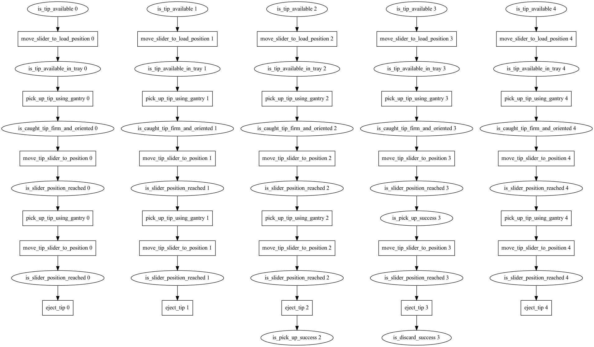

# Llama-Btree

Idea is to have a library of behaviour tree action and conditional nodes. Allow LLM to combine them in sequences to create behaviours in response to user requests.

> Keywords: Behaviour Tree, LLM, Language Models, Task Generation, Few-Shot Learning, Prompt Programming

# Example
> User: "Pick up the sample and place it in the PCR."
>
> LLM: 

# Evaluation
 - Effect of temperature on the agent's performance
 - Accuracy compared to human performance
 - Hallucination rate
 - Precondition disregard count
 - Variance in the number of actions taken
 - Comparision between different LLMs (Llama, Gpt-3, etc.)

# References
- [Robot Behavior-Tree-Based Task Generation with Large Language Models](https://arxiv.org/pdf/2302.12927.pdf)
- [Language Models as Zero-Shot Planners: Extracting Actionable Knowledge for Embodied Agents](https://arxiv.org/abs/2201.07207)
- [Self-Refine: Iterative Refinement with Self-Feedback](https://arxiv.org/abs/2303.17651)
- [Auto-GPT](https://github.com/Torantulino/Auto-GPT)
- [Survey of Hallucination in Natural Language Generation](https://arxiv.org/pdf/2202.03629.pdf)
- [Do As I Can, Not As I Say: Grounding Language in Robotic Affordances](https://arxiv.org/abs/2204.01691)
- [Behavior-Tree Embeddings for Robot Task-Level Knowledge](https://ieeexplore.ieee.org/document/9981774/) NEED TO READ
- [Prompt Programming for Large Language Models: Beyond the Few-Shot Paradigm](https://arxiv.org/pdf/2102.07350.pdf)
